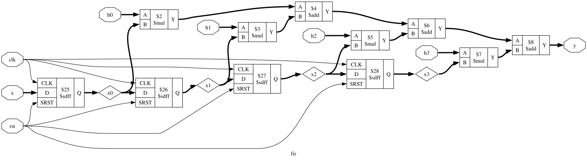
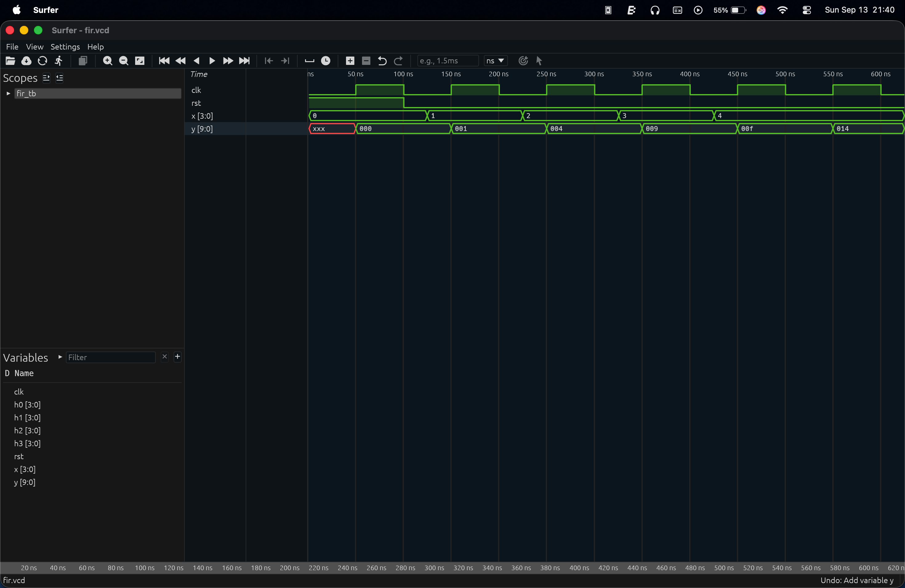
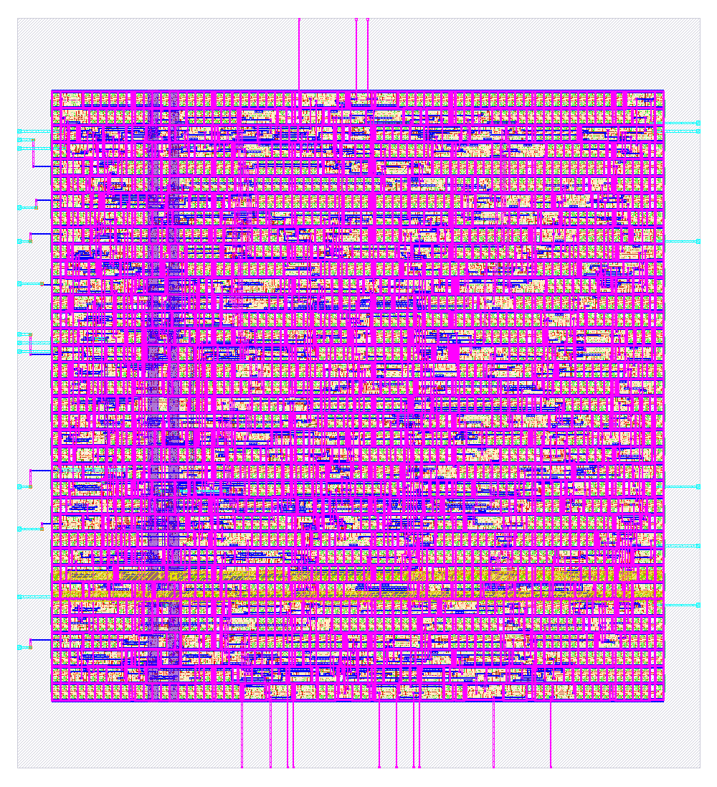

# 4-Bit FIR Filter (Verilog RTL & LibreLane ASIC Implementation)

A 4-tap, 4-bit Finite Impulse Response (FIR) Filter implemented in Verilog RTL, fully simulated and implemented using the **LibreLane / OpenROAD** open-source ASIC physical design flow on the **SkyWater 130nm (sky130A) PDK**.

---

## 📌 Features & Specifications
- **Architecture**: 4-Tap Transversal Direct Form FIR Filter
- **Input Data Width ($x$)**: 4-bit
- **Filter Coefficients ($h_0, h_1, h_2, h_3$)**: 4-bit programmable/configurable inputs
- **Output Data Width ($y$)**: 10-bit output to prevent overflow:
  $$\text{Max Output} = 4 \times (15 \times 15) = 900 \le 1023 \, (2^{10} - 1)$$
- **Clock & Reset**: Active-high synchronous reset (`rst`) and single-phase clock (`clk`).

---

## 📐 Filter Equation

$$y[n] = h_0 \cdot x[n] + h_1 \cdot x[n-1] + h_2 \cdot x[n-2] + h_3 \cdot x[n-3]$$

---

## 📁 Repository Structure

```
.
├── rtl/
│   └── fir.v                      # Top-level 4-Bit FIR Filter Verilog RTL Module
├── verification/
│   └── fir_tb.v                   # Testbench module for functional verification
├── simulation/
│   ├── fir.vcd                    # VCD waveform dump file
│   └── waveform.png               # Simulation waveform output graph
├── synthesis/
│   ├── fir_synth.v                # Synthesized Netlist Module
│   └── schematic/
│       ├── fir_schematic.svg      # RTL Schematic Diagram (SVG Vector)
│       └── fir_schematic.dot      # Graphviz DOT file for schematic
├── physical_design/
│   └── librelane/                 # LibreLane / OpenROAD ASIC Physical Design outputs
│       ├── gds/fir.gds            # GDSII Layout File
│       ├── def/fir.def            # DEF Layout File
│       ├── sdc/fir.sdc            # SDC Constraints File
│       └── layout.png             # Physical Layout Render Image
└── README.md                      # Project documentation
```

---

## 🎨 RTL Schematic Diagram



---

## 🌊 Waveform & Simulation Output

### Waveform Result (`simulation/waveform.png`):


### Expected Output Sequence:

| Time (ns) | Reset | $x$ | $x_0$ | $x_1$ | $x_2$ | $x_3$ | Calculated Output $y$ |
| :--- | :--- | :--- | :--- | :--- | :--- | :--- | :--- |
| **0 - 100** | `1` | `0` | `0` | `0` | `0` | `0` | **0** |
| **100 - 125** | `0` | `1` | `0` | `0` | `0` | `0` | **0** |
| **125 - 225** | `0` | `2` | `1` | `0` | `0` | `0` | **1** $(1 \times 1)$ |
| **225 - 325** | `0` | `3` | `2` | `1` | `0` | `0` | **4** $(1 \times 2 + 2 \times 1)$ |
| **325 - 425** | `0` | `4` | `3` | `2` | `1` | `0` | **9** $(1 \times 3 + 2 \times 2 + 2 \times 1)$ |
| **425 - 625** | `0` | `4` | `4` | `3` | `2` | `1` | **19** $(1 \times 4 + 2 \times 3 + 2 \times 2 + 1 \times 1)$ |

---

## 🛠 LibreLane ASIC Physical Design

### Physical Design Layout (`physical_design/librelane/layout.png`):


The physical design flow was executed using **LibreLane** targeting the **SkyWater 130nm (sky130A) PDK**:

1. **Synthesis (Yosys)**: Gate-level synthesis and technology mapping.
2. **Floorplanning & Power Planning**: Core aspect ratio configuration, power ring and stripe generation ($VDD$ / $VSS$).
3. **Placement**: Standard cell placement with setup/hold timing optimization.
4. **Clock Tree Synthesis (CTS)**: Low-skew clock tree insertion.
5. **Routing (OpenROAD / Detailed Routing)**: Global & detailed routing.
6. **Signoff Verification**: DRC (Design Rule Check), LVS (Layout Vs. Schematic), and Antenna checks.

---

## 🚀 How to Run

### Simulation (Icarus Verilog):
```bash
# Compile design and testbench
iverilog -o simulation/fir_sim rtl/fir.v verification/fir_tb.v

# Run simulation
vvp simulation/fir_sim
```

### Physical Design Flow (LibreLane):
```bash
cd librelane
librelane fir/config.yaml
```

---

## 📜 License
This project is open-source under the MIT License.
